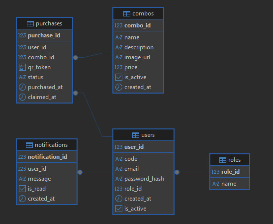

# LunchUIS
Sistema de Gestión de Combos – Universidad Industrial de Santander

## Introducción
LunchUIS es un sistema web diseñado para la administración y compra de combos saludables en la Universidad Industrial de Santander (UIS). El proyecto busca digitalizar y optimizar el proceso de adquisición del “combo saludable”, ofreciendo una experiencia más rápida, segura y ecológica para estudiantes y administradores.  

Desarrollado con HTML5, CSS3, JavaScript Genérico, Spring Boot, Postgres, entre otros, el sistema ofrece autenticación por roles (Administrador/Usuario), gestión completa de combos, persistencia local y remota de datos, y un diseño responsive adaptable a diferentes dispositivos. Además, implementa comunicación mediante HTTPS, control de versiones con GitHub, y se gestiona bajo la metodología Scrum (Jira).

## Objetivo del Proyecto
Desarrollar una plataforma web integral que permita:
- Comprar y gestionar combos saludables desde cualquier dispositivo.  
- Reducir las filas y el tiempo de espera.  
- Controlar las compras mediante autenticación institucional.  
- Eliminar el uso de tickets físicos y su impacto ambiental.  
- Mejorar la transparencia y eficiencia del proceso.

## Problemática
Actualmente, los estudiantes deben hacer largas filas para adquirir el combo saludable, lo que genera pérdida de tiempo, riesgo de duplicación de compras con carnets ajenos y pérdida de tickets físicos. LunchUIS soluciona estos inconvenientes mediante una aplicación web con acceso autenticado y tickets digitales.

## Visión del Proyecto
Modernizar la experiencia del servicio de alimentación en la UIS mediante una herramienta eficiente, segura y sostenible, que a futuro pueda escalarse para la gestión de otros servicios universitarios.

## Funcionalidades Principales
### Para Administradores
- Crear, editar y eliminar combos.  
- Control de precios (diario/mensual) y disponibilidad.
- Visualización de pedidos y estadísticas del sistema.  

### Para Usuarios
- Ver el catálogo de combos disponibles con precios.  
- Agregar combos al carrito de compras.  
- Seleccionar tipo de pago (diario/mensual).  
- Confirmar pedidos y consultar historial personal.  

## Requerimientos Funcionales
RF1: Ingresar al sistema  
RF2: Crear combo  
RF3: Modificar combo  
RF4: Eliminar combo  

## Requerimientos No Funcionales
RNF1: Arquitectura basada en microservicios  
RNF2: Disponibilidad de 13 horas diarias (7 a.m. – 8 p.m.)  
RNF3: Capacidad para manejar al menos 500 transacciones simultáneas  
RNF4: Autenticación de dos factores (2FA)  

## Estructura del Sistema
Sistema modular con paneles separados para administradores y usuarios, gestión completa de combos, pedidos y autenticación integrada.  

## Modelo de Base de Datos

A continuación se muestra el diseño del modelo relacional utilizado en el sistema:  

## Equipo de Desarrollo
| Rol                          | Nombre                                            |
| ---------------------------- | ------------------------------------------------- |
| **Product Owner**            | Mag. Carlos Adolfo Beltrán Castro                 |
| **Scrum Master**             | Kevin Daniel Castro Mendoza                       |
| **Developer – Architecture** | Andrea Juliana Portilla Barrera                   |
| **Developer – Coding**       | Kevin Castro, Sebastián Mantilla, Andrea Portilla |
| **QA Member**                | Juan Sebastián Mantilla Serrano                   |
