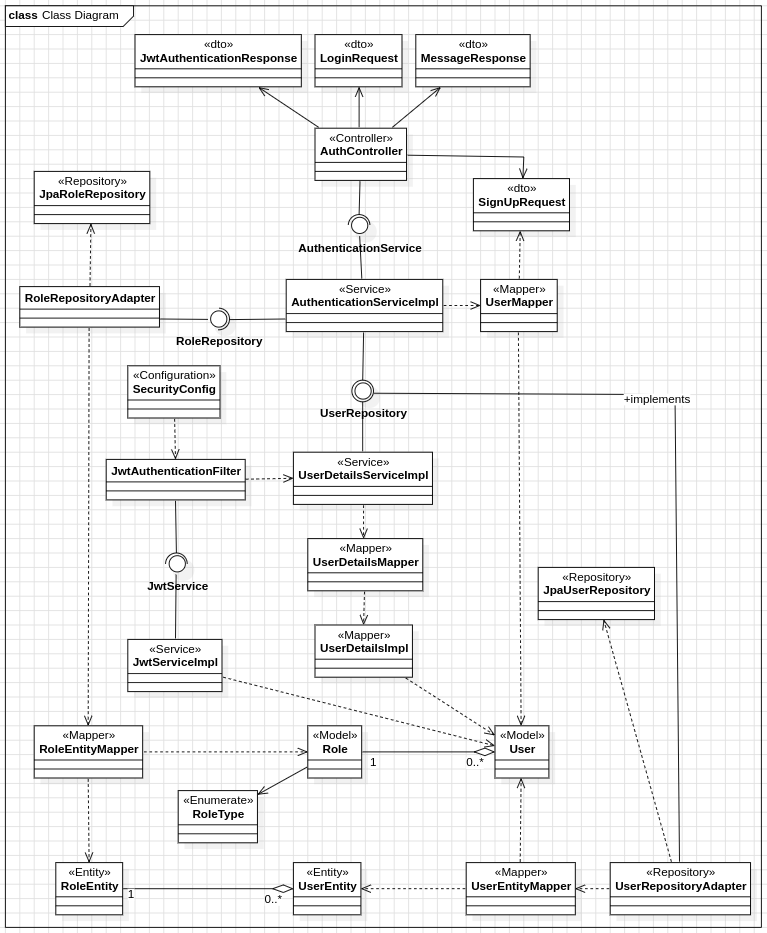
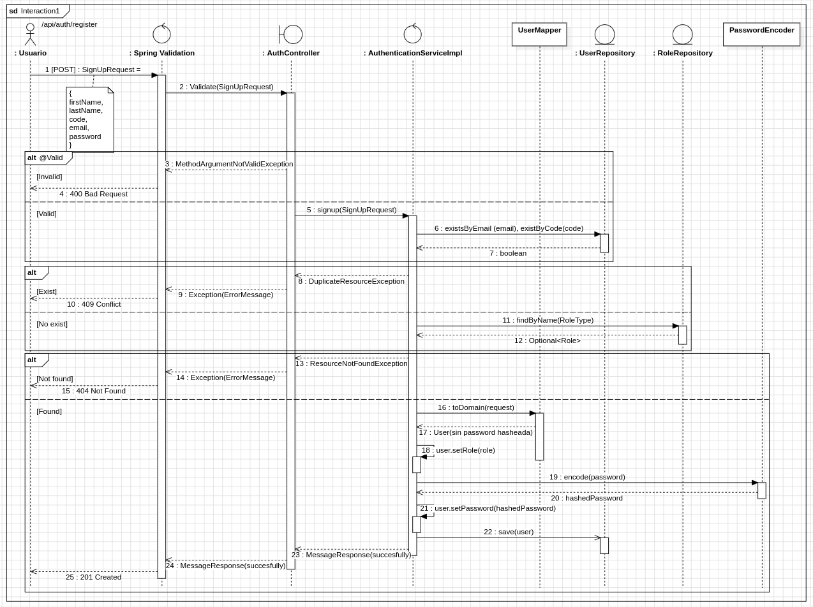

# 🔐 Identity Service

The Identity Service is the security cornerstone of the **LunchUIS** platform. It handles all aspects of user management, authentication, and authorization using a stateless JWT-based approach.

## ✨ Key Features

-   **Stateless JWT Authentication:** Secure communication using JSON Web Tokens.
-   **Secure Password Hashing:** Utilizes `BCrypt` to store user passwords securely.
-   **Role-Based Access Control (RBAC):** Differentiates between user roles (e.g., `STUDENT`, `ADMIN`).
-   **Clean Architecture:** Built following Clean/Hexagonal Architecture principles, separating domain, application, and infrastructure layers.
-   **API Documentation:** Self-documented endpoints using Swagger (OpenAPI).

## 🔑 API Endpoints

Here are the primary public endpoints provided by this service:

| Method | Path                | Description                                     | Success Response |
| :----- | :------------------ | :---------------------------------------------- | :--------------- |
| `POST` | `/api/auth/signup`  | Registers a new user with the default `STUDENT` role. | `201 Created`    |
| `POST` | `/api/auth/login`   | Authenticates a user and returns a JWT.         | `200 OK`         |

---

## 🏗️ Architecture & Diagrams

> **Note:** For the general package structure and overall system architecture, please refer to the main `README.md` in the project root.

### Class Diagram (Conceptual)

This diagram shows the key classes and their relationships across the main architectural layers.

### Sequence Diagram: User Registration Flow

This diagram illustrates the step-by-step process of a new user signing up.

---

## ⚙️ Technology Stack
* **Framework**: Spring Boot 3
* **Security**: Spring Security 6
* **Database**: PostgreSQL (managed via Spring Data JPA)
* **Authentication**: JSON Web Tokens (JWT)
* **Mapping**: MapStruct
* **API Docs**: SpringDoc (Swagger UI)
* **Build Tool**: Maven

---

## 🛠️ Setup and Running
1. **Prerequisites**: Ensure you have Java 21+, Docker, and Docker Compose installed.
2. **Start Database**: From the project root, run docker-compose up -d to start the PostgreSQL container.
3. **Run the Application**: Execute the main method in IdentityServiceApplication.java from your IDE.
4. **API Access**: The service will be available at http://localhost:8081.
5. **Swagger UI**: You can explore the API documentation at http://localhost:8081/swagger-ui.html.

> **Security Note**: The JWT secret key and expiration time are configured in the application.properties file. For a production environment, these should be managed via external configuration or environment variables.